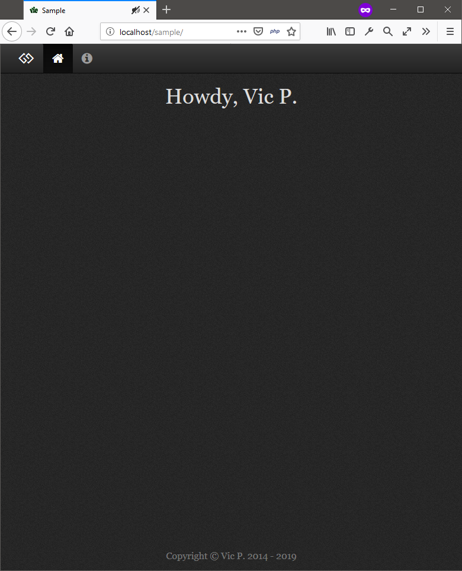
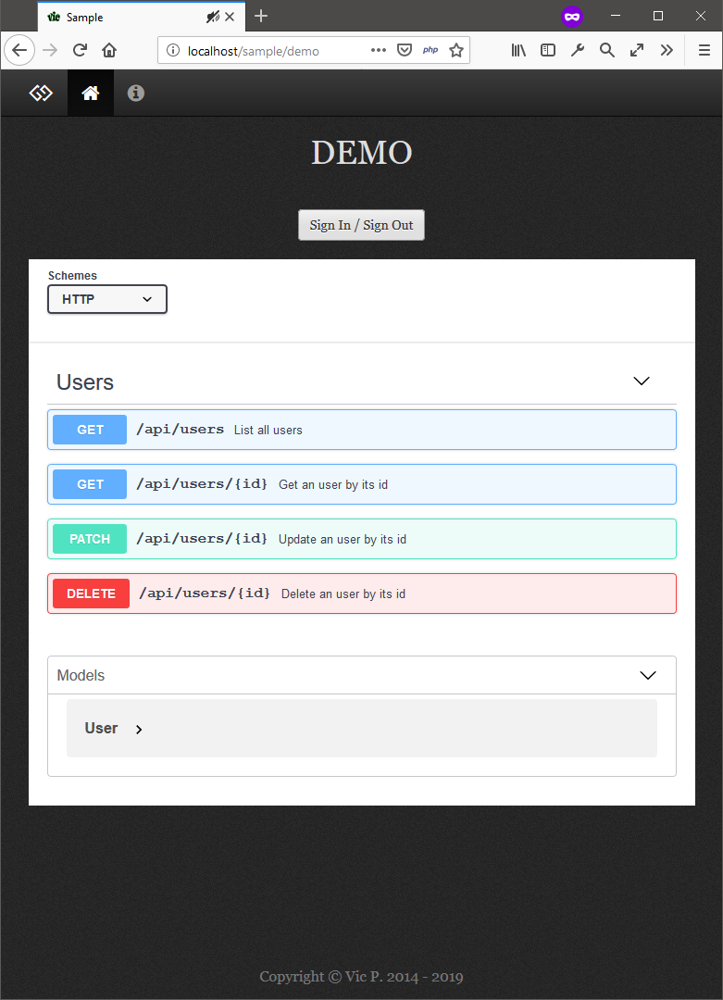
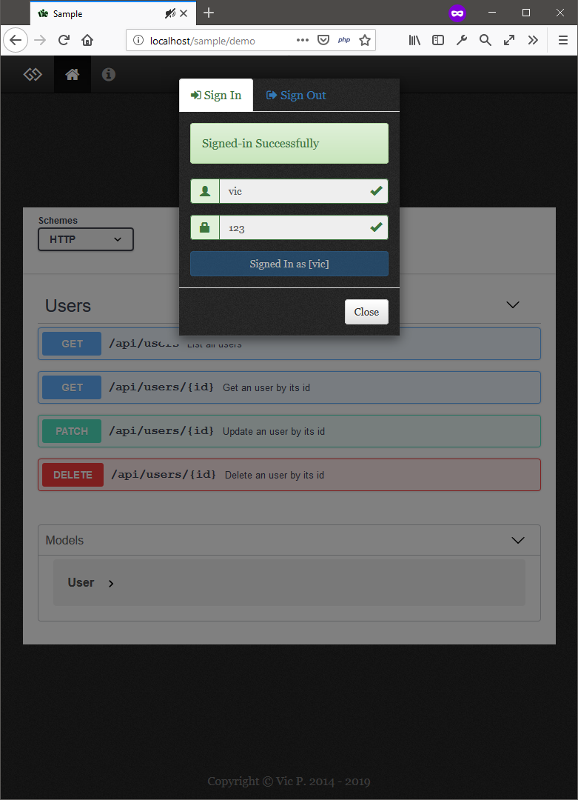
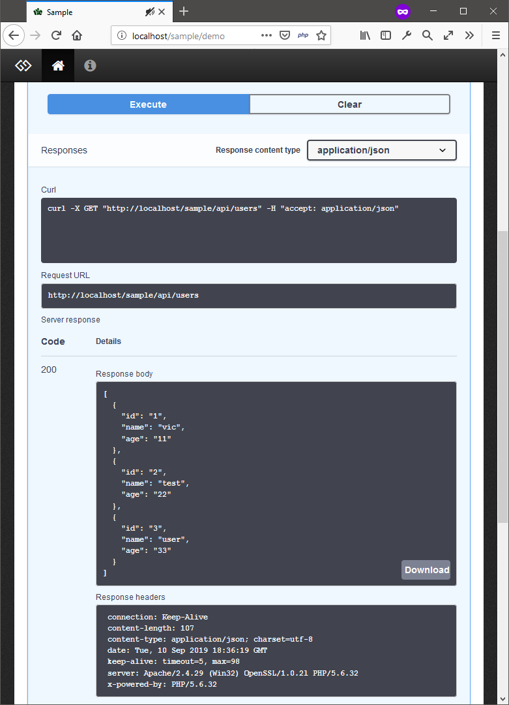
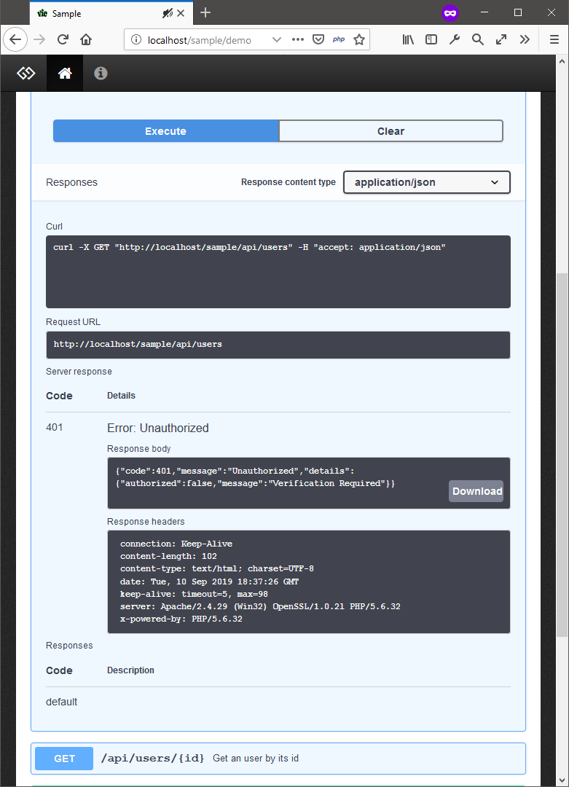

# Sample

### Introduction
Sample is a template project for fast, simple, easy creating a web-site-app based on [MVC Design Pattern](https://en.wikipedia.org/wiki/Model%E2%80%93view%E2%80%93controller) & [RESTful API](https://en.wikipedia.org/wiki/Representational_state_transfer)

### License
Under the [MIT](LICENSE) license

### Keywords for features
  - Server / Client
  - [RESTful API](https://en.wikipedia.org/wiki/Representational_state_transfer) (Protected by JWT Authentication - Bearer Schema)
  - [JSON Web Token](https://jwt.io/) - (User-defined RSA private/public key file)
  - [MVC Design Pattern](https://en.wikipedia.org/wiki/Model%E2%80%93view%E2%80%93controller)
  - PHP, HTML, JS, CSS, MySQL
  - [Flight micro-framework](http://flightphp.com/), [jQuery](https://jquery.com/), [Bootstrap](https://getbootstrap.com/), [Font Awesome](https://fontawesome.com/), [Swagger UI](https://swagger.io/), [Bootstrap Validator](https://bootstrap-validate.js.org/)
  - Based on one template page that meaning only design page content

### Keywords for demo
  - Sign In / Sign Out to access protected APIs
  - Protected User APIs - Create/Get/Update/Delete
  - Test User APIs via Swagger UI

### Requirements
PHP 5.6 or greater

### Installation

1. Make sure `Apache` & `MySQL` service is running on your machine
2. Clone the project to `localhost` directory as the name `sample`
3. Import the database file at `/sample/demo.database.sql` to your `MySQL`
4. Okay. Take a look the home page at [localhost/sample](http://localhost/sample), the demo page at [localhost/sample/demo](http://localhost/sample/demo), the user/pass for testing is `vic/123` or `test/123` or `user/123`

Note:
> To change the base `/sample` to another such as root-level `/` or sub-level `/example` we have to edit `commons/defines.php:$SUB_PATH` and `demo.swagger.yaml:basePath`

> The demo files are started with the prefix `demo.*` and these are deletable eg. `demo.content.php, demo.swagger.js, etc`

### Contact
Feel free to contact via [Twitter](https://twitter.com/vic4key) or [Email](mailto:vic4key@gmail.com) or [Website](http://vic.onl/)

### Screenshots

